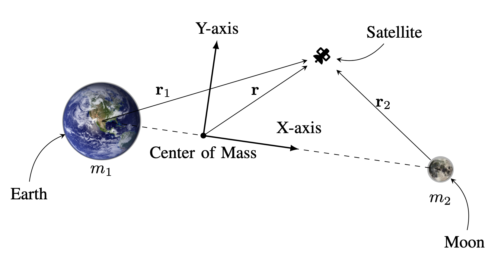
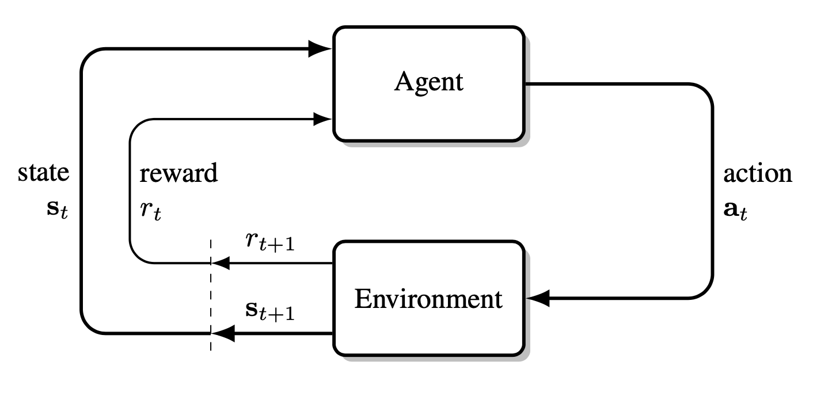
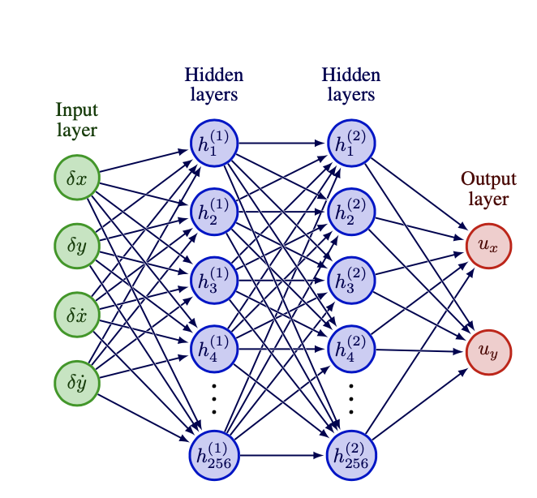
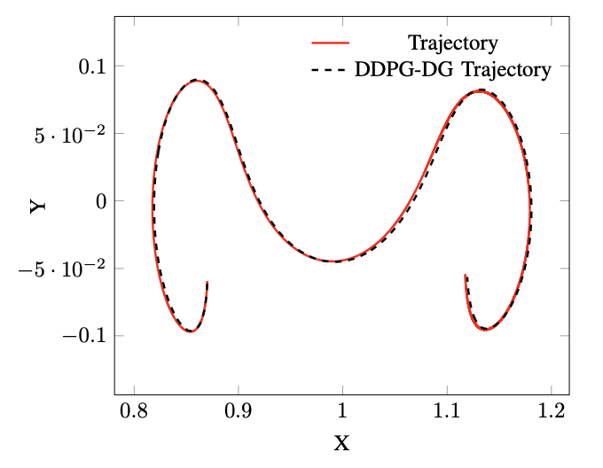
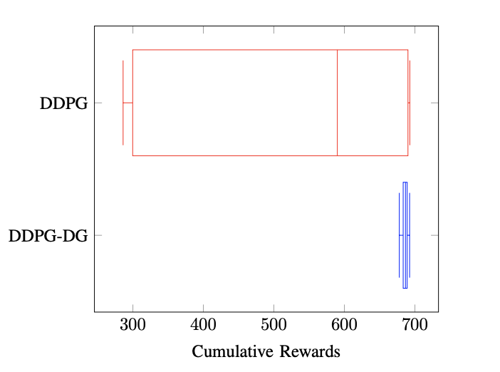
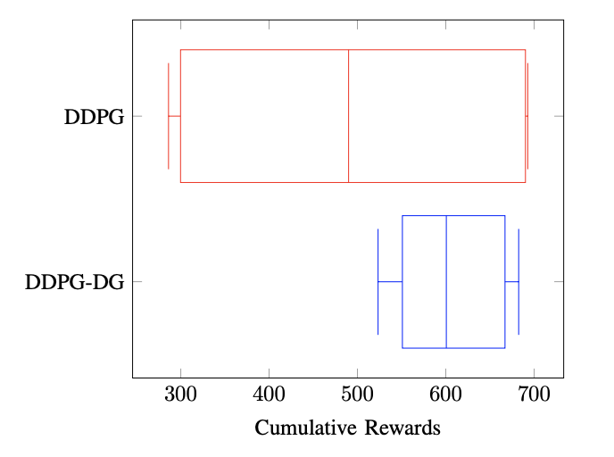
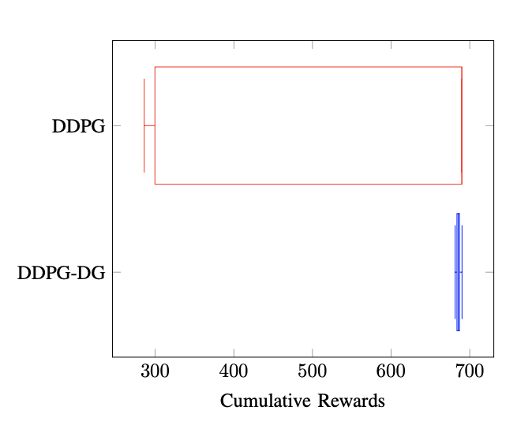

# Robust DDPG Reinforcement Learning Differential Game Guidance in Low-Thrust, Multi-Body Dynamical Environments

## Authors

* Ali Baniasad

  * Department of Aerospace Engineering

  * Sharif University of Technology

  * Tehran, Iran

  * ali_baniasad@ae.sharif.edu

* Hadi Nobahari

  * Department of Aerospace Engineering

  * Sharif University of Technology

  * Tehran, Iran

  * nobahari@sharif.edu

## Abstract

Onboard autonomy is essential for deep-space missions, where spacecraft must navigate complex, multi-body environments with limited computational resources. Traditional guidance methods often require simplified dynamic models or high computational power, making them impractical for onboard implementation. This study proposes a reinforcement learning-based differential game framework for designing an adaptive, closed-loop controller for low-thrust spacecraft guidance. Unlike conventional methods, this approach does not require an explicit analytical model of the system's dynamics. Instead, it learns directly from the nonlinear motion equations, enabling a data-driven control strategy. A neural network-based controller is trained using the Deep Deterministic Policy Gradient Differential Game (DDPG-DG) algorithm to generate real-time low-thrust control commands efficiently. The method is validated through simulations of Lyapunov orbit transfers in the Earth-Moon system, where it demonstrates strong robustness to disturbances, engine imperfections, and environmental variations. The results highlight the potential of reinforcement learning-based differential game strategies to enhance spacecraft autonomy in complex gravitational environments.

## Keywords

Reinforcement learning, Differential games, Robust control, Low-thrust propulsion, Multi-body dynamics

## Introduction

The development of onboard autonomy is critical for enabling sustained robotic and human exploration in deep space. A key challenge lies in implementing autonomous guidance systems for low-thrust spacecraft operating within intricate multi-body dynamical settings, like the Earth-Moon system. This study establishes Reinforcement Learning (RL), a machine learning (ML) methodology, as a computationally efficient and model-agnostic framework for synthesizing neural network-based controllers. These controllers enable closed-loop guidance in complex dynamical regimes, adapt to evolving mission constraints, and are deployable onboard future spacecraft.

Modern missions, such as NASA's Gateway and Artemis programs, require autonomous Guidance, Navigation, and Control (GNC) systems to navigate multi-body gravitational fields and diverse propulsion architectures. Crewed missions (e.g., Orion) and robotic ventures (e.g., Europa Clipper) demand robust autonomy to address communication delays, operational costs, and dynamical complexities. Solar Electric Propulsion (SEP) missions, including Lunar IceCube, LunaH-Map, and Psyche, face unique challenges due to continuous low-thrust propulsion in sensitive multi-body regimes. Traditional trajectory optimization methods, reliant on simplified dynamics or ground-based computation, lack adaptability and computational feasibility for onboard use. Reinforcement Learning overcomes these limitations by facilitating direct interaction with high-fidelity dynamical models, while decoupling the computationally intensive pre-flight training process from the real-time, lightweight execution of neural network-based controllers.

Current onboard guidance strategies depend on precomputed trajectory databases or two-body approximations, which struggle in multi-body environments. While dynamical systems theory and invariant manifolds aid in generating initial trajectory guesses, their computational cost and reliance on human intervention hinder onboard implementation. Neural networks address these gaps by mapping spacecraft states directly to control commands, generating feasible startup arcs for low-thrust targeting. Hybrid frameworks that integrate neural networks with traditional targeting methods leverage computational speed and algorithmic robustness to satisfy mission constraints.

Machine learning is increasingly integral to space autonomy. Mars rovers employ ML for autonomous target selection (e.g., AEGIS on Curiosity), reducing ground dependency for tasks like image analysis. Future applications include autonomous robotics on Perseverance and anomaly detection for Europa Clipper. RL-driven neural controllers prioritize feasibility over optimality, enabling rapid in-flight re-computation of control commands via lightweight linear algebra operations, thus reducing reliance on iterative optimization. This approach reduces reliance on iterative optimization, mitigates communication risks, and enhances adaptability, positioning RL as a cornerstone of next-generation autonomous space missions.

While deep reinforcement learning offers promising solutions, traditional methods in spacecraft guidance often rely on simplified models or pre-computed trajectory databases, which are not suitable for real-time operations in multi-body environments. DDPG has emerged as a robust solution for continuous control tasks, as it does not require a pre-defined analytical model of the system. However, pure DDPG is limited when it comes to multi-agent dynamics or complex interactions in multi-body systems, where spacecraft motion is influenced by gravitational forces from multiple bodies.

To address these limitations, this study introduces a novel Deep Deterministic Policy Gradient Differential Game (DDPG-DG) framework. By incorporating differential game theory, DDPG-DG extends the DDPG algorithm to handle multi-agent control tasks in a multi-body environment, where two spacecraft interact as competitive agents. This approach enhances the performance of the DDPG-based controller in the presence of disturbances, non-ideal engine behavior, and variations in environmental parameters, making it more robust than pure DDPG. The proposed method maintains the computational efficiency of DDPG while providing better adaptability to complex dynamical settings.

## Problem Statement

The three-body problem provides a representative dynamical framework for the inherent movement in cislunar space. Although the suggested control strategy does not rely on a specific dynamical model, the Circular Restricted Three-Body Problem (CR3BP) is used as a platform for robustness assessment. The CR3BP offers a complex yet relevant dynamical context for future space missions, while maintaining a sufficiently simplified structure to facilitate an initial assessment of the control strategy. Furthermore, low-thrust engine is integrated to evaluate the effectiveness of the algorithm under conditions of constrained control capacity and significant nonlinearities. While the suggested guidance strategy directly produces a sequence of control actions, the trained neural network operates as a resilient controller across various scenarios. This adaptability is demonstrated through its ability to enhance performance in different operational conditions, illustrating its potential for improving onboard guidance.

### Dynamical Model

Two fundamental celestial bodies' gravitational pull on an infinitesimal mass is modeled by the CR3BP. The Earth and Moon, two spherically symmetric masses, follow circular orbits around their common barycenter in this framework. As seen in Fig. 1, the third body, a spacecraft, moves independently relative to the barycenter. The relative size of the primaries is characterized by the mass ratio:

$$
\mu = \frac{M_2}{M_1 + M_2}
$$


where $ M_1 $ is Earth mass and $ M_2 $ is Moon mass. Furthermore, the model presumes that the spacecraft's mass is insignificant relative to that of the central bodies, thus having no effect on their motion. The state of the spacecraft, defined by its position and velocity vectors 
$ \mathbf{r}$ and $ \mathbf{v}$, respectively, is represented as:

$$
\boldsymbol{\rho}_{\text{spatial}} = \begin{bmatrix} x & y & z & \dot{x} & \dot{y} & \dot{z} \end{bmatrix}^T
$$


where:

* $x, y, z$ are the spacecraft's position coordinates relative to the rotating frame.

* $\dot{x}, \dot{y}, \dot{z}$ are the corresponding velocity components.

These state variables are advanced relative to the barycenter within a rotating coordinate system, illustrated by the dashed lines in Fig. 1.

By incorporating low-thrust components into the governing equations, the additional propulsion force of the engine modifies the natural equations of motion in the CR3BP is shown as:
$$
\begin{aligned}
	\ddot{x} &= 2\dot{y} + x - \frac{(1-\mu)(x+\mu)}{r_1^3} - \frac{\mu(x-1+\mu)}{r_2^3} + u_x \\
	\ddot{y} &= -2\dot{x} + y - \frac{(1-\mu)y}{r_1^3} - \frac{\mu y}{r_2^3} + u_y \\
	\ddot{z} &= -\frac{(1-\mu)z}{r_1^3} - \frac{\mu z}{r_2^3} + u_z
\end{aligned}
$$
where the control inputs $ u_x $, $ u_y $, and $ u_z $ represent the thrust components along the spacecraft's body-fixed axes. The distances $ r_1 $ and $ r_2 $ are defined as:
$$
\begin{aligned}
	r_1 &= \sqrt{(x+\mu)^2 + y^2 + z^2} \\
	r_2 &= \sqrt{(x-1+\mu)^2 + y^2 + z^2}
\end{aligned}
$$
The state-space representation of the CR3BP with low-thrust terms is given by:

$$
\dot{\boldsymbol{\rho}} = \boldsymbol{f}(\boldsymbol{\rho}, \boldsymbol{u})
$$


where $ \boldsymbol{\rho} $ is the state vector and $ \boldsymbol{u} $ is the control input vector. The state-space representation is used to define the spacecraft's trajectory in the CR3BP, incorporating the effects of the low-thrust engine.


<p align="center">Definition of a planar CR3BP vector.</p>


<!-- *Your image caption goes here.*
*Figure 1: Definition of a planar CR3BP vector.* (Reference to `../Figure/TBP/Earth.png` and `../Figure/TBP/Moon.png` from LaTeX) -->

### Low-Thrust Control Problem

The motion in the CR3BP is inherently nonlinear, displaying significant sensitivity in dynamical structures. Consequently, the proposed strategy based on differential games and reinforcement learning leverages the impact of the low-thrust terms to attain the intended dynamical response. The thrust $\mathbf{a}_{lt}$ is determined by:

$$
\mathbf{a}_{lt} = {u}_x \hat{i} + {u}_y \hat{j} + {u}_z \hat{k}
$$


where $ \hat{u}_x $, $ \hat{u}_y $, and $ \hat{u}_z $ are the components of the thrust unit vector in the rotating frame of the CR3BP. Furthermore, the thrust direction is characterized by the thrust magnitude $ f $ and the spacecraft's nondimensional mass $ m = \frac{M_3}{M_{3,0}} $, where $ M_3 $ denotes the spacecraft mass at the beginning of the thrust segment and $ M_{3,0} $ is the initial mass. The nondimensional thrust intensity $ f $ is calculated as follows:

$$
f = \dfrac{Ft^*}{l^* M_{3,0}}
$$


where $ F $, $t^*$, and $l^*$ are thrust in kilonewtons, system characteristic time in seconds, and system characteristic length in meters, respectively.

For this study, a representative spacecraft is selected, which has a maximum thrust capacity of $ f_{\text{max}} = 0.04 $. An analysis between this spacecraft and other existing or forthcoming propulsion systems is summarized in Table 1.

*Table 1: Nondimensionalized low-thrust capabilities of various spacecraft in the Earth-Moon system.*

| **Abbrv.** | **Spacecraft** | **$f_{\text{max, nondim}}$** | **$M_{3,0}$ (kg)** | **$F_{\text{max}}$ (mN)** |
|--------|-------------------|--------------------------|----------------|-----------------------|
| DS1    | Deep Space 1      | $6.940 \cdot 10^{-2}$    | 486.3          | 92.0                  |
| Psyche | Psyche            | $4.158 \cdot 10^{-2}$    | 2464           | 279.3                 |
| Dawn   | Dawn              | $2.741 \cdot 10^{-2}$    | 1217.8         | 91.0                  |
| LIC    | Lunar IceCube     | $3.276 \cdot 10^{-2}$    | 14             | 1.25                  |
| H1     | Hayabusa 1        | $1.640 \cdot 10^{-2}$    | 510            | 22.8                  |
| H2     | Hayabusa 2        | $1.628 \cdot 10^{-2}$    | 608.6          | 27.0                  |
| s/c    | Sample spacecraft | $4 \cdot 10^{-2}$        | n/a            | n/a                   |

## Guidance Framework Design

This guidance framework leverages reinforcement learning to develop a differential game-based strategy for low-thrust spacecraft in the Earth-Moon environment. It enhances robustness to disturbances, non-ideal engine performance, and parameter variations, while complementing traditional targeting methods. The framework uses the Deep Deterministic Policy Gradient Differential Game (DDPG-DG) algorithm, a model-free, off-policy reinforcement learning approach suited for continuous action spaces. Trained through a differential game where two spacecraft interact as competitive agents, the strategy optimizes control policies in a simulated Earth-Moon system. Evaluated through Lyapunov orbit transfers, the approach demonstrates robustness to perturbations and generalization across mission scenarios and engine models, advancing autonomous spacecraft navigation for deep-space missions.

### Differential Game Formulation

The differential game formulation models dynamic interactions between two competing players in zero-sum games, where one player’s gain equals the other’s loss. The game is defined over a continuous time interval, with the system’s state $ \boldsymbol{x}(t) $ evolving according to differential equations influenced by the players’ control inputs $ \boldsymbol{u}_1(t) $ and $ \boldsymbol{u}_2(t) $. This formulation is widely used in control theory and reinforcement learning to model competitive, evolving strategies.

The state dynamics of the system can be described by the following differential equations:

$$
\dot{\boldsymbol{\rho}} = \boldsymbol{f}(\boldsymbol{\rho}, \boldsymbol{u}_1(t), \boldsymbol{u}_2(t)), \quad r = \boldsymbol{h}( \boldsymbol{s}, \boldsymbol{u}_1(t), \boldsymbol{u}_2(t))
$$


where $ \boldsymbol{\rho} $ is the system state vector, $ \boldsymbol{u}_1(t) $ and $ \boldsymbol{u}_2(t) $ are the control inputs of players 1 and 2, respectively. The $\boldsymbol{s} = \begin{bmatrix} \delta \boldsymbol{\rho} & \delta \dot{\boldsymbol{\rho}} \end{bmatrix}$ is the RL state which is the difference vector between the spacecraft and trajectory, and $ r $ is reward. The players aim to optimize their control policies to maximize their rewards, which are defined as the negative of the other player's reward.

### Reinforcement Learning

Reinforcement learning is a machine learning paradigm where agents learn optimal control policies through interactions with an environment to maximize cumulative rewards. The agent observes the environment's state, selects actions based on its policy, receives rewards, and iteratively updates its policy to enhance performance. The objective is to learn a policy that maximizes the expected cumulative reward over time.

#### Fundamentals

Reinforcement learning encompasses algorithms where an agent acquires the ability to accomplish a task by interaction with an environment. The agent, functioning as a controller, maps observed states to corresponding control commands. It receives feedback from the environment in the form of rewards, which reflect the quality of its actions. The environment provides relevant state information, which the agent uses to determine appropriate control commands. In response, the environment updates its state and calculates a reward, indicating the benefit of the action taken. This iterative process allows the agent to refine its policy—the decision-making strategy—with the goal of maximizing cumulative rewards over time.

In many RL scenarios, terminal conditions are introduced, resulting in the cessation of the learning process. Under these conditions, the environment usually resets to an initial state, and the training cycle resumes. Such scenarios are categorized as episodic tasks, in which each episode corresponds to a distinct effort by the agent to address a problem. A conceptual overview of the RL process is presented in Fig. 2. This diagram illustrates the three key signals---state, action, and reward---that facilitate interaction between the agent and the environment at discrete time steps, $ t $ and $ t+1 $. Although the reinforcement learning framework primarily employs the terms environment, agent, and action, these concepts align closely with the established engineering terminology of controller, system dynamics (or plant), and control input.


<p align="center">The agent-environment process in a Markov decision process.</p>
<!-- *Your image caption goes here.*
*Figure 2: The agent-environment process in a Markov decision process.* -->

The agent discovers a complex dynamical model that helps its decision-making without external supervision. This process is formalized as an MDP, a classical model for sequential decision-making that integrates actions with feedback. The MDP serves as the theoretical foundation for reinforcement learning, providing an idealized mathematical framework for the problem. In the context of an infinite-horizon, discounted framework, a Markov Decision Process is mathematically characterized by the tuple $ \langle A, S, P, r, q_0, \gamma \rangle $, where $ A $ and $ S $ denote the collections of all potential actions and states, respectively. The function $ P: S \times A \times S \to [0, 1] $ which defines the probability of moving from one state to another as a result of taking a specific action. The reward function is denoted by $ r: S \to \mathbb{R} $, mapping states to real-valued rewards. The initial state distribution is represented by $ q_0 $, while $ \gamma \in [0, 1] $ is the discount factor, governing the present value of future rewards.

By weighing both present and future returns, an agent aims to create a policy that maximizes its anticipated rewards and $ G_t $, expected return, is defined as the sum of future discounted benefits, which is how this balance is formalized:

$$
G_t = \sum_{k=t+1}^{T} \gamma^{k-t-1} r_k
$$


where $ \gamma$ determines the relative importance of the present and future rewards. All future benefits are seen as equally significant when $ \gamma = 1 $, whereas just the present reward is taken into consideration when $ \gamma = 0 $. The value function tells the agent about the quality of a specific state, is formalized as a result of the notion of expected return. For an MDP, the state-value function $ V^\pi(s_t) $ is described as:

$$
V^\pi(s_t) = \mathbb{E}_\pi \left[ G_t | s_t \right] = \mathbb{E}_\pi \left[ \sum_{k=t+1}^{T} \gamma^{k-t-1} r_k | s_t \right]
$$


where $ \pi $ denotes the policy that the agent follows. The action-value function $ Q^\pi(s_t, a_t) $ is described as:

$$
Q^\pi(s_t, a_t) = \mathbb{E}_\pi \left[ G_t | s_t, a_t \right] = \mathbb{E}_\pi \left[ \sum_{k=t+1}^{T} \gamma^{k-t-1} r_k | s_t, a_t \right]
$$


which represents the expected return when the agent is in state $ s_t $, takes action $ a_t $, and follows policy $ \pi $ thereafter. The value functions and action-value functions are related by:

$$
V^\pi(s_t) = \mathbb{E}_{a_t \sim \pi} \left[ Q^\pi(s_t, a_t) \right]
$$


Policy optimization techniques aim to directly derive a parameterized control policy, $ \pi_\theta(a | s) $, where $ \theta $ denotes the policy parameters. Unlike methods using value optimization, like Deep Q-Networks (DQN) and $ Q $-Learning, policy optimization is particularly effective for problems with continuous action spaces.

A prominent class of reinforcement learning methods consists of hybrid algorithms, commonly referred to as actor-critic frameworks. These approaches simultaneously optimize the policy (the actor) and the value function (the critic), with both components use neural networks. Among various actor-critic schemes, Deep Deterministic Policy Gradient (DDPG) is particularly suited for continuous action spaces and is employed in this study. DDPG has demonstrated considerable success in high-dimensional continuous control tasks and is the method of choice for this investigation.

#### Neural Networks

Neural networks are a category of machine learning architectures that are inspired by the human brain. Neural networks are composed of interconnected units, commonly referred to as neurons, arranged in hierarchical layers. Each neuron receives input from the preceding layer, applies a nonlinear activation function, and generates an output that is forwarded to the subsequent layer. These networks possess the capability to model intricate patterns and dependencies within data, enabling them to excel in a diverse array of machine learning applications, including image classification, natural language processing, and reinforcement learning.


<p align="center">Actor Network Structure.</p>


<p align="center">Critic Network Structure.</p>

### Deep Deterministic Policy Gradient Differential Game

The Deep Deterministic Policy Gradient Differential Game (DDPG-DG) approach combines the strengths of reinforcement learning with differential game theory to address control challenges in multi-agent, continuous action settings. By leveraging the DDPG algorithm within a differential game framework, this method enables the simultaneous optimization of policies for interacting agents, providing a robust solution to complex, real-world dynamic control problems. The following section details the formulation and implementation of DDPG-DG for spacecraft guidance in multi-body environments.

#### Policy and Value Functions

In the context of the Deep Deterministic Policy Gradient Differential Game (DDPG-DG), the system involves two agents, each of which learns a deterministic policy $ \pi_{\theta}(s) $ that maps states $ s $ to actions $ a $. These policies are parameterized by neural networks with weights $ \theta $, and the objective is to optimize the policy parameters to maximize the expected cumulative return. For simplicity and clarity, the same notation $ \pi $ used for the policies of both agents, as their policies follow the same functional form and differ only in their individual parameters.

The goal of DDPG-DG is to learn the optimal action-value function, $ Q^{\pi^*}(s, a) $, which provides the expected return for each state-action pair under the Nash equilibrium policy $ \pi^* $. The Nash equilibrium policy is the optimal policy for each agent, given the other agent's policy. The actor network $ \pi_{\theta}(s) $ is responsible for selecting actions, while the critic network $ Q_{\phi}(s, a) $ evaluates these actions by computing the Q-value. The actor network outputs the action directly, while the critic network estimates the Q-value for a given state-action pair. Both networks are trained using the DDPG algorithm to optimize the policy and value functions. The structure of the actor and critic networks is shown in Fig. 3 and Fig. 4, respectively. The actor network and critic network consist of fully connected layers with ReLU activation functions. The actor network outputs the action directly, while the critic network estimates the Q-value for a given state-action pair. The actor network is trained to maximize the Q-value, while the critic network is trained to minimize the error between the predicted Q-value and the target Q-value.

#### DDPG-DG Objective

The DDPG algorithm involves optimizing two primary functions for each player: the policy function (actor) and the Q-function (critic). The actor is responsible for selecting actions, while the critic evaluates these actions by computing the Q-value.

For the Q-function, the update rule is based on the Bellman equation for continuous action spaces, which provides a target for the Q-function update. The Bellman backup equation is given by:

$$
y = r + \gamma Q'(s', a'; \theta)
$$


where $ r $ is the immediate reward, $ s' $ is the next state, $ a' $ is the action chosen by the target policy $ \pi_{\theta}(s') $, and $ Q'(s', a'; \theta) $ is the target Q-value. The target Q-value is estimated using the target Q-network, which has parameters $ \theta $ and is periodically updated to stabilize training.


#### DDPG-DG Algorithm

The Deep Deterministic Policy Gradient Differential Game (DDPG-DG) algorithm is implemented using two neural networks for each player: the actor network \( \pi_{\theta}(s) \) and the critic network \( Q_{\theta}(s, a) \). These networks are trained using the following algorithm:

Algorithm 1: Deep Deterministic Policy Gradient Differential Game

* Input: initial policy parameters $\theta_1$, $\theta_2$, Q-function parameters $\phi_1$, $\phi_2$, empty replay buffer $\mathcal{D}$
* Set target parameters equal to main parameters $\theta_{\text{targ},1} \leftarrow \theta_1$, $\theta_{\text{targ},2} \leftarrow \theta_2$, $\phi_{\text{targ},1} \leftarrow \phi_1$, $\phi_{\text{targ},2} \leftarrow \phi_2$
* Repeat:
    * Observe state $s$
    * Select action for player 1: $a_1 = \text{clip}(\mu_{\theta_1}(s) + \epsilon_1, a_{Low}, a_{High})$, where $\epsilon_1 \sim \mathcal{N}$
    * Select action for player 2: $a_2 = \text{clip}(\mu_{\theta_2}(s) + \epsilon_2, a_{Low}, a_{High})$, where $\epsilon_2 \sim \mathcal{N}$
    * Execute actions $(a_1, a_2)$ in the environment.
    * Observe next state $s'$, reward pair $(r_1, r_2)$ for both players, and done signal $d$
    * Store transition $(s, a_1, a_2, r_1, r_2, s', d)$ in replay buffer $\mathcal{D}$
    * If $s'$ is terminal:
        * Reset environment state.
    * If it's time to update:
        * For j in range (however many updates):
            * Randomly sample a batch of transitions, $B = \{ (s, a_1, a_2, r_1, r_2, s', d) \}$ from $\mathcal{D}$
            * Compute targets for both players:
                * $y_1 = r_1 + \gamma (1 - d) Q_{\phi_{\text{targ},1}}(s', \mu_{\theta_{\text{targ},1}}(s'), \mu_{\theta_{\text{targ},2}}(s'))$
                * $y_2 = r_2 + \gamma (1 - d) Q_{\phi_{\text{targ},2}}(s', \mu_{\theta_{\text{targ},1}}(s'), \mu_{\theta_{\text{targ},2}}(s'))$
            * Update Q-functions for both players by one step of gradient descent:
                * $\nabla_{\phi_1} \frac{1}{|B|} \sum_{B} \left( Q_{\phi_1}(s, a_1, a_2) - y_1(r_1, s', d) \right)^2$
                * $\nabla_{\phi_2} \frac{1}{|B|} \sum_{B} \left( Q_{\phi_2}(s, a_1, a_2) - y_2(r_2, s', d) \right)^2$
            * Update policies for both players by one step of gradient ascent:
                * $\nabla_{\theta_1} \frac{1}{|B|} \sum_{s \in B} Q_{\phi_1}(s, \mu_{\theta_1}(s), \mu_{\theta_2}(s))$
                * $\nabla_{\theta_2} \frac{1}{|B|} \sum_{s \in B} Q_{\phi_2}(s, \mu_{\theta_1}(s), \mu_{\theta_2}(s))$
            * Update target networks for both players:
                * $\phi_{\text{targ},1} \leftarrow \rho \phi_{\text{targ},1} + (1 - \rho) \phi_1$
                * $\phi_{\text{targ},2} \leftarrow \rho \phi_{\text{targ},2} + (1 - \rho) \phi_2$
                * $\theta_{\text{targ},1} \leftarrow \rho \theta_{\text{targ},1} + (1 - \rho) \theta_1$
                * $\theta_{\text{targ},2} \leftarrow \rho \theta_{\text{targ},2} + (1 - \rho) \theta_2$
* Until convergence


### Exploration and Exploitation

In DDPG-DG, the exploration of the environment is achieved by adding noise to the action selection process. This noise, typically Gaussian or Ornstein-Uhlenbeck noise, encourages the agent to explore the environment while still utilizing the learned policy. The balance between exploration and exploitation is maintained throughout the training process, with the noise gradually decaying as the policy converges.

### Environment Configuration

The environment for the differential game-based guidance strategy is designed to capture the dynamics of the CR3BP with low-thrust terms. The CR3BP is a classical dynamical system that models the motion of a spacecraft in the vicinity of two primary bodies, such as the Earth and the Moon, where the gravitational forces of the two bodies dominate the spacecraft's motion. The low-thrust terms represent the effects of a continuous thrust engine on the spacecraft's trajectory, allowing for more precise control over the spacecraft's motion.

#### State Representation

The state of the environment is defined by the position and velocity vectors of the spacecraft in the rotating frame of the CR3BP. The state vector is given by $ \boldsymbol{s} = \begin{bmatrix} \delta x & \delta y & \delta \dot{x} & \delta \dot{y} \end{bmatrix}^\mathrm{T} $, where $ \delta x $ and $ \delta y $ are the deviations in the spacecraft's position from the nominal trajectory, and $ \delta \dot{x} $ and $ \delta \dot{y} $ are the deviations in the spacecraft's velocity. The state vector captures the relative position and velocity of the spacecraft with respect to the nominal trajectory, providing the necessary information for the guidance strategy to make decisions.

#### Action Representation

The action space of the environment corresponds to the control inputs of the spacecraft, which are the thrust components along the spacecraft's body-fixed axes. The action vector is given by $ \boldsymbol{a} = \begin{bmatrix} u_x & u_y \end{bmatrix}^\mathrm{T} $, where $ u_x $ and $ u_y $ represent the thrust components along the spacecraft's body-fixed axes. The action space allows the guidance strategy to adjust the thrust direction and magnitude to control the spacecraft's trajectory.

#### Reward Function

The reward function of the environment is designed to incentivize the spacecraft to reach the desired Lyapunov orbit while minimizing deviations from the nominal trajectory. The reward function is defined as:

$$
r = -\alpha \left( \delta x^2 + \delta y^2 \right) - \beta \left( \delta \dot{x}^2 + \delta \dot{y}^2 \right)
$$


where $ \alpha $ and $ \beta $ are weighting factors that determine the importance of position and velocity deviations in the reward calculation. The reward function encourages the spacecraft to reduce its position and velocity deviations, leading to a more accurate trajectory following.

## Mission Application: Libration Point Transfer

The proposed guidance framework is applied to a mission scenario involving a transfer between Lyapunov orbits in the Earth-Moon system. The mission objective is to transfer a spacecraft from a lower-energy Lyapunov orbit to a higher-energy Lyapunov orbit using low-thrust propulsion. The guidance strategy is trained using the differential game-based reinforcement learning approach and is evaluated on its ability to perform the transfer accurately and efficiently. The mission application demonstrates the effectiveness of the guidance strategy in handling complex trajectory optimization tasks in multi-body dynamical environments.

### Neural Network-Based Guidance

The guidance strategy is implemented using neural networks to approximate the policy and value functions in the DDPG-DG algorithm. The actor network is responsible for selecting actions based on the current state of the environment, while the critic network evaluates the quality of these actions by estimating the Q-value. The neural networks are trained using the differential game formulation to optimize the spacecraft's trajectory during the Lyapunov orbit transfer. The guidance strategy leverages the capabilities of deep reinforcement learning to develop robust and adaptive control policies that can handle the complexities of the CR3BP dynamics and low-thrust propulsion. The results shown in Fig. 5 demonstrate the effectiveness of the neural network-based guidance strategy in achieving accurate and efficient trajectory optimization in the Earth-Moon system.



<p align="center">Example trajectory transfer between Lyapunov orbits.</p>

## Robustness and Generalization

The robustness and generalization capabilities of the guidance strategy are evaluated through a series of simulation experiments that introduce disturbances, non-ideal thrust engine models, and model parameter variations. The experiments are designed to test the guidance strategy's ability to adapt to changing conditions and generalize across different mission scenarios. The results demonstrate the robustness of the guidance strategy against disturbances and model uncertainties, as well as its ability to generalize effectively across different mission scenarios and low-thrust engine configurations. The guidance strategy exhibits strong performance relative to conventional targeting methods in simulation studies.

The three scenarios considered for the robustness and generalization experiments for disturbances, non-ideal thrust engine models, and model parameter variations are shown here, respectively.


<p align="center">Comparison of the total rewards obtained by the DDPG and DDPG-DG algorithms in the presence of disturbances.</p>



<p align="center">Comparison of the total rewards obtained by the DDPG and DDPG-DG algorithms in the presence of non-ideal thrust engine models.</p>



<p align="center">Comparison of the total rewards obtained by the DDPG and DDPG-DG algorithms in the presence of gravitational parameter variation.</p>

<!-- *Figure 6: Comparison of the total rewards obtained by the DDPG and DDPG-DG algorithms in the presence of disturbances.* (Reference to TikZ plot data from LaTeX)
*Figure 7: Comparison of the total rewards obtained by the DDPG and DDPG-DG algorithms in the presence of non-ideal thrust engine models.* (Reference to TikZ plot data from LaTeX)
*Figure 8: Comparison of the total rewards obtained by the DDPG and DDPG-DG algorithms in the presence of gravitational parameter variation.* (Reference to TikZ plot data from LaTeX) -->

## Conclusion and Future Work

### Conclusion

This study introduced DDPG-DG, a reinforcement learning-based differential game framework for low-thrust spacecraft guidance in multi-body environments. By integrating Deep Deterministic Policy Gradient (DDPG) with differential game theory, DDPG-DG enables adaptive, real-time control without requiring simplified dynamical models. Simulations of Lyapunov orbit transfers in the Earth-Moon system show that DDPG-DG outperforms standard DDPG in handling multi-agent interactions, disturbances, and real-time computational constraints, making it suitable for onboard applications.

### Future Work

Further research can extend differential game theory to other RL frameworks, such as model-based RL for improved sample efficiency and multi-agent RL for decentralized spacecraft coordination. Safe RL applications should integrate constraint-based learning to enforce safety limits, robust policy adaptation for fault tolerance, and formal verification to ensure mission-critical reliability. Real-time deployment on embedded systems, high-fidelity simulations, and hardware-in-the-loop testing will further validate DDPG-DG’s practicality for autonomous space missions.


## Citation

If you use this work, please cite the following paper:

```bibtex
@inproceedings{BaniAsad2025RobustDDPG,
  author={A. BaniAsad and H. Nobahari},
  booktitle={Proc. of 23rd International Conference of Iranian Aerospace Society},
  title={Robust DDPG Reinforcement Learning Differential Game Guidance in Low-Thrust, Multi-Body Dynamical Environments},
  year={2025}
}